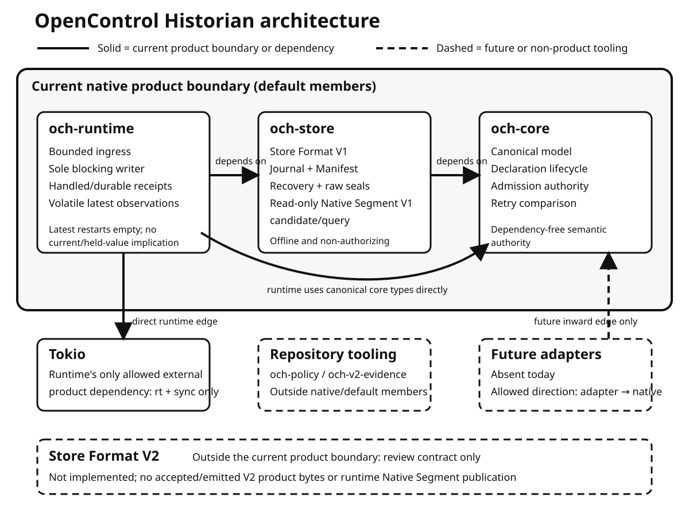

# OpenControl Historian

[](https://github.com/jscott3201/open-control-historian/actions/workflows/pr.yml)

> **Early-stage, source-only Rust workspace.** The workspace version is `0.0.0`,
> every package has `publish = false`, and there is no supported product CLI,
> published crate release, network service, or production-readiness, support, or
> SLA claim.

OpenControl Historian is building a small, bounded Historian foundation around a
dependency-free **canonical Historian data model**. The repository currently
contains reviewed canonical contracts, a Store Format V1 durability path, bounded
runtime ingress and publication, and an offline one-generation Native Segment V1
candidate/query proof.



**Text alternative:** The current native product boundary contains
`och-runtime -> och-store -> och-core`, with runtime also using canonical core
types directly. Runtime alone may depend on Tokio with only `rt` and `sync`.
Repository tooling is outside native default members. Future adapters are absent
and may point only inward. Store Format V2 is outside the current boundary as an
unimplemented review contract.

## What exists today

- **`och-core`:** dependency-free canonical identity, exact value/time/quality,
  declaration lifecycle, source/capture provenance, collection, admission, and
  retry-comparison contracts.
- **`och-store`:** Store Format V1 Journal, Manifest, registry/retry/catalog,
  raw-seal, conservative recovery, and typed storage-pressure behavior under the
  documented V1 filesystem contract.
- **`och-runtime`:** bounded ingress, one dedicated blocking writer, handled and
  durable receipt stages, bounded lifecycle control, and volatile latest
  observation snapshots.
- **Native Segment V1 candidate/query:** a dependency-free, offline, read-only,
  non-authorizing candidate and bounded observation query for exactly one
  catalog-committed sealed raw-Journal generation. It is not a published segment,
  durable query authority, or runtime query service.

> **Durable-format boundary:** current product authority is **Store Format V1
> only**. Store Format V2 and the M03-PR03e native evidence plan are design and
> evidence review barriers for possible future work. Current code neither accepts
> nor emits V2 product bytes and does not implement Native Segment publication.

Durability claims are limited to the documented Store Format V1 process,
filesystem-operation, synchronization, and recovery contract. They are not a
universal physical-power-loss or physical-media guarantee. Latest observations
restart empty and never imply current or held values.

## Build from source

The crates are not published. To verify the workspace from source:

```console
git clone https://github.com/jscott3201/open-control-historian.git
cd open-control-historian
rustup toolchain install 1.98.0 --profile minimal --component clippy,rustfmt
cargo +1.98.0 check --workspace --locked
```

This checks the source workspace; it does not start a Historian product. The full
PR gate additionally requires cargo nextest 0.9.143 and cargo-deny 0.20.2:

```console
./scripts/gate.sh pr
```

GitHub PR CI runs that gate on Linux. This is evidence for that CI environment,
not a complete platform support matrix. See [Contributing](CONTRIBUTING.md) for
the exact development and validation workflow.

## Workspace map

| Package | Role | Current purpose |
| --- | --- | --- |
| [`och-core`](crates/och-core/) | native, default member | Canonical model, declaration, provenance, admission, and retry contracts; its example is only a build/measurement sanity marker, not a Historian CLI |
| [`och-store`](crates/och-store/) | native, default member | Store Format V1 persistence/recovery and offline Native Segment V1 candidate/query |
| [`och-runtime`](crates/och-runtime/) | native, default member | Bounded store-scoped ingress, sole-writer ordering, receipts, and volatile latest observations |
| [`och-policy`](tools/och-policy/) | private tooling | Repository dependency-policy validation outside the native product closure |
| [`och-v2-evidence`](tools/och-v2-evidence/) | private tooling | Standalone evidence tooling outside default members; not a user or product CLI |

The current product dependency direction is `och-runtime -> och-store ->
och-core`, while runtime also depends directly on core for canonical types.
`och-core` has no dependencies. The only external product exception is the direct
`och-runtime -> tokio` edge with default features disabled and only `rt` and
`sync` enabled.

## Deliberate non-goals

The repository does not currently provide a network service, SQL/query engine,
multi-generation or runtime historical query, durable latest-state projection,
retention/reclamation, adapters, cloud/object storage, migration or compatibility
decoder, or Store Format V2 implementation. Published observations do not imply
hold, interpolation, freshness, or current-value semantics.

## Documentation and community

- [Documentation index](docs/README.md) — current contracts, historical delivery
  records, and clearly separated future design/evidence material
- [Architecture](docs/architecture.md), [canonical model contract](docs/model-contract.md),
  and [dependency policy](docs/dependency-policy.md)
- [Store Format V1](docs/store-format-v1.md), [Journal V1](docs/journal-v1-format.md),
  and [Native Segment V1 candidate](docs/native-segment-v1-format.md)
- [Contributing](CONTRIBUTING.md) and [Code of Conduct](CODE_OF_CONDUCT.md)
- [Security policy](SECURITY.md) — never report vulnerabilities in public issues,
  pull requests, or discussions
- [Repository automation constraints](AGENTS.md)

## License

Licensed under either the [Apache License 2.0](LICENSE-APACHE) or
[MIT License](LICENSE-MIT), at your option.
